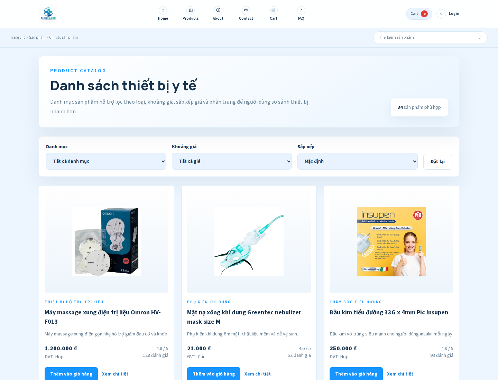
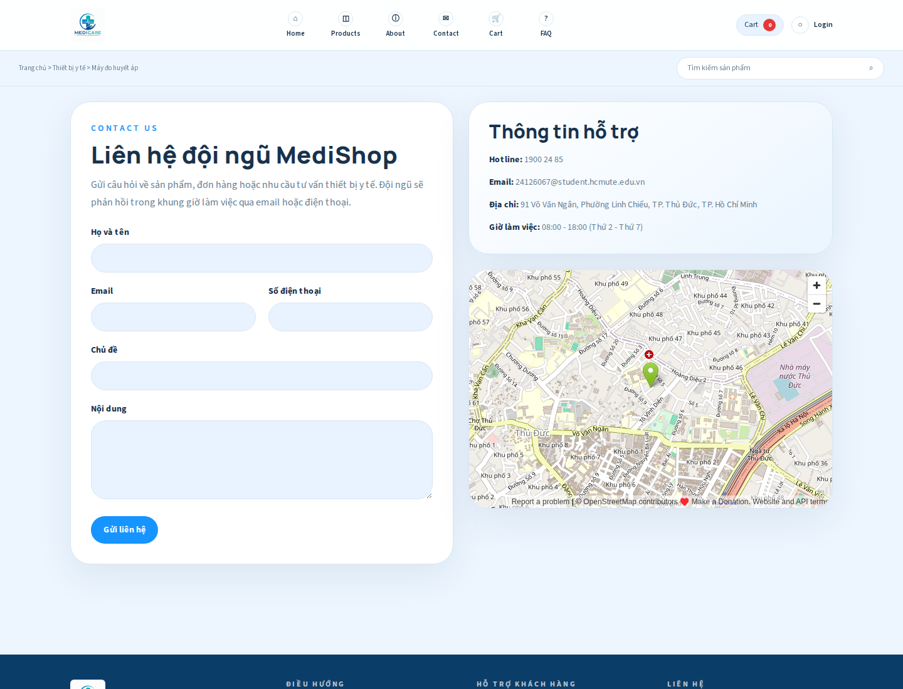

# Hồ Sơ Nộp Bài - MEDICARE Nhóm 7

Thư mục này gom các mục cần nộp theo yêu cầu, đã bỏ các phần Word, PowerPoint và YouTube theo phạm vi hiện tại.

## 1. File Thiết Kế Figma

Figma dùng dạng link view-only, gồm wireframe và mockup:

| Hạng mục | Link |
| --- | --- |
| Mockup 1 | https://www.figma.com/design/M23P3OxhEhCE7il6dnzoKN/Medical-Equipment?node-id=0-1&p=f&t=Cyr3LEOTjthMpP0s-0 |
| Wireframe | https://www.figma.com/design/M23P3OxhEhCE7il6dnzoKN/Medical-Equipment?node-id=128-337&p=f&t=Cyr3LEOTjthMpP0s-0 |
| Mockup 2 | https://www.figma.com/design/M23P3OxhEhCE7il6dnzoKN/Medical-Equipment?node-id=2-2&p=f&t=Cyr3LEOTjthMpP0s-0 |

## 2. Source Code Next.js + Tailwind CSS

Source code nằm tại thư mục gốc của repository này:

```text
../
```

Các thư mục chính:

- `app/`: các route Next.js App Router.
- `components/`: component dùng chung.
- `lib/`: dữ liệu và helper.
- `public/`: ảnh/logo/asset public.
- `.github/workflows/`: workflow deploy GitHub Pages.
- `tests/`: Playwright test cơ bản.

## 3. GitHub Repository Public

Link repository:

```text
https://github.com/baohan24126067/nhom07_thietbiyte
```

Repository chứa toàn bộ source code, lịch sử commit và GitHub Actions deploy.

## 4. GitHub Pages

Link website đã deploy:

```text
https://baohan24126067.github.io/nhom07_thietbiyte/
```

Giảng viên có thể mở trực tiếp link này để kiểm tra giao diện đã public.

## 5. Ảnh Chụp Giao Diện

Các ảnh chụp màn hình chính đã được đặt trong:

```text
submission/screenshots/
```

### Trang chủ


### Danh sách sản phẩm



### Liên hệ



## 6. Ghi Chú Nộp Bài

- Không kèm file Word vì phần này chưa được yêu cầu cung cấp nội dung báo cáo tổng hợp.
- Không kèm file PowerPoint vì phần này chưa được yêu cầu trong gói hiện tại.
- Không kèm link YouTube vì chỉ cần khi báo cáo online/public video.
- README chính của project vẫn nằm ở `../README.md` và có đầy đủ hướng dẫn chạy local, deploy, thành viên, phân công và hướng phát triển.
